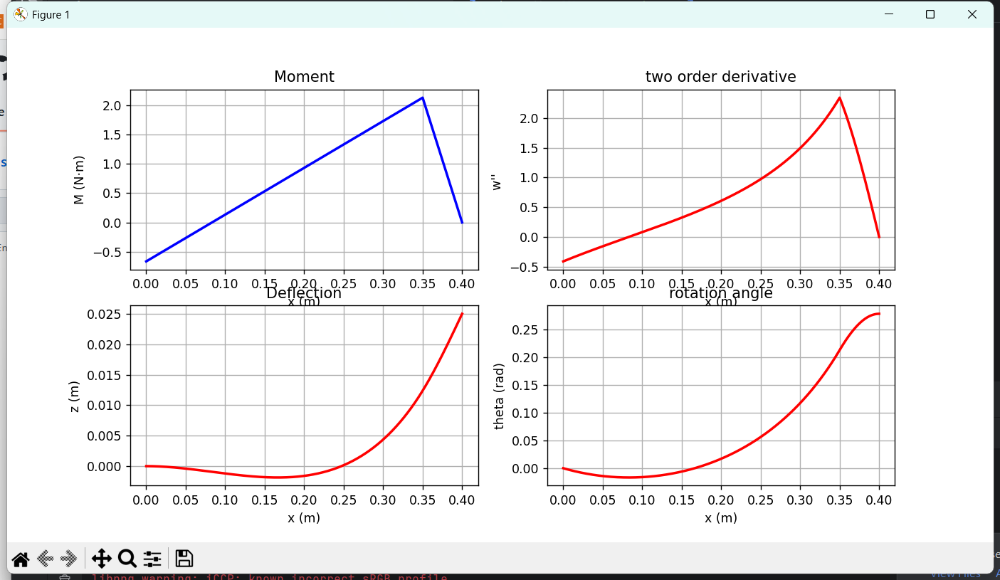

# 弹性梁模型
# Elastic beam model project

这是一个用于计算如上图所示两点受力的弹性梁模型的计算程序。

This is a programme for solution of an elastic beam with load at two point, as shown in fig above.

计算结果包括弯矩图，挠度的二阶导数（曲率），挠度以及挠度的一阶导数（转角的正弦）

The results include: Moment, 2-order derivative of deflection (curvature), deflection and 2-order derivative of deflection ( sin(rotation angel) )

示例结果如下图所示

Example results are shown below.
